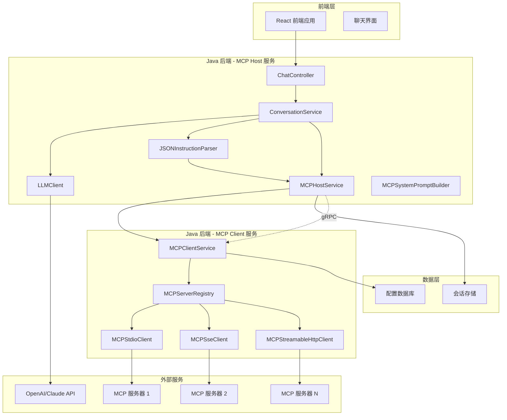

# 设计文档

## 概述

本设计文档描述了统一 AI 聊天系统的技术架构和实现方案。该系统采用微服务架构，将 MCP Host 和 MCP Client 都部署在 Java 后端。系统通过 LLM 客户端与大模型通信，MCP Host 解析大模型响应中的 JSON 指令，通过 gRPC 调用 MCP Client 服务执行工具调用。前端通过统一的对话 API 与后端通信，实现无缝的 AI 助手体验。

## 架构

### 系统架构图



### 分层架构

1. **前端层**：React 应用，提供统一的聊天界面
2. **MCP Host 层**：处理 LLM 通信和 JSON 指令解析
3. **MCP Client 层**：管理 MCP 服务器连接和工具调用
4. **gRPC 通信层**：Host 和 Client 服务间的通信
5. **数据层**：配置持久化和会话管理

## 组件和接口

### MCP Host 服务核心组件

#### 1. ConversationService（对话服务）

负责处理用户消息，协调 LLM 调用和 MCP 工具执行。

```java
@Service
public class ConversationService {
    @Autowired
    private LLMClient llmClient;
    
    @Autowired
    private MCPHostService mcpHostService;
    
    @Autowired
    private JSONInstructionParser instructionParser;
    
    @Autowired
    private MCPSystemPromptBuilder promptBuilder;
    
    public ConversationResponse processUserMessage(String userMessage, String conversationId) {
        try {
            // 1. 构建包含 MCP 工具信息的系统提示
            String systemPrompt = promptBuilder.buildSystemPromptWithMCPTools();
            
            // 2. 发送请求到大模型
            LLMResponse llmResponse = llmClient.sendMessage(systemPrompt, userMessage, conversationId);
            
            // 3. 解析响应中的 JSON 指令
            List<MCPInstruction> mcpInstructions = instructionParser.parseInstructions(llmResponse.getContent());
            
            // 4. 执行 MCP 工具调用并替换响应内容
            String finalResponse = mcpHostService.processMCPInstructions(llmResponse.getContent(), mcpInstructions);
            
            return ConversationResponse.builder()
                    .content(finalResponse)
                    .conversationId(conversationId)
                    .build();
        } catch (Exception e) {
            log.error("处理对话失败", e);
            throw new ConversationException("处理失败: " + e.getMessage());
        }
    }
}
```

#### 2. JSONInstructionParser（JSON 指令解析器）

负责从 LLM 响应中提取和解析 MCP 工具调用指令。

```java
@Component
public class JSONInstructionParser {
    private final ObjectMapper objectMapper;
    
    public List<MCPInstruction> parseInstructions(String llmResponse) {
        List<MCPInstruction> instructions = new ArrayList<>();
        
        // 使用正则表达式提取 JSON 代码块
        Pattern jsonPattern = Pattern.compile("```json\\s*({.*?})\\s*```", Pattern.DOTALL);
        Matcher matcher = jsonPattern.matcher(llmResponse);
        
        while (matcher.find()) {
            try {
                String jsonStr = matcher.group(1);
                JsonNode jsonNode = objectMapper.readTree(jsonStr);
                
                // 检查是否为 MCP 工具调用指令
                if (isMCPInstruction(jsonNode)) {
                    MCPInstruction instruction = parseMCPInstruction(jsonNode);
                    instructions.add(instruction);
                }
            } catch (Exception e) {
                log.warn("解析 JSON 指令失败: {}", matcher.group(1), e);
            }
        }
        
        return instructions;
    }
    
    private boolean isMCPInstruction(JsonNode jsonNode) {
        return jsonNode.has("type") && "use_mcp_tool".equals(jsonNode.get("type").asText());
    }
    
    private MCPInstruction parseMCPInstruction(JsonNode jsonNode) {
        return MCPInstruction.builder()
                .type(jsonNode.get("type").asText())
                .serverName(jsonNode.get("server_name").asText())
                .toolName(jsonNode.get("tool_name").asText())
                .arguments(parseArguments(jsonNode.get("arguments")))
                .build();
    }
}
```

#### 3. MCPHostService（MCP 主机服务）

负责处理 MCP 指令执行和响应替换。

```java
@Service
public class MCPHostService {
    @Autowired
    private MCPClientServiceGrpc.MCPClientServiceBlockingStub mcpClientStub;
    
    public String processMCPInstructions(String originalResponse, List<MCPInstruction> instructions) {
        if (instructions.isEmpty()) {
            return originalResponse;
        }
        
        StringBuilder processedResponse = new StringBuilder(originalResponse);
        
        for (MCPInstruction instruction : instructions) {
            try {
                // 通过 gRPC 调用 MCP Client 服务
                MCPToolResult result = executeMCPTool(instruction);
                
                // 替换原始响应中的 JSON 指令为实际结果
                String placeholder = generatePlaceholder(instruction);
                String replacement = formatToolResult(result);
                processedResponse = new StringBuilder(
                    processedResponse.toString().replace(placeholder, replacement)
                );
            } catch (Exception e) {
                log.error("执行 MCP 工具失败: {}", instruction, e);
                // 可以选择显示错误信息或保持原始指令
            }
        }
        
        return processedResponse.toString();
    }
    
    private MCPToolResult executeMCPTool(MCPInstruction instruction) {
        // 构建 gRPC 请求
        MCPToolRequest request = MCPToolRequest.newBuilder()
                .setServerName(instruction.getServerName())
                .setToolName(instruction.getToolName())
                .putAllArguments(instruction.getArguments())
                .build();
        
        // 调用 MCP Client 服务
        MCPToolResponse response = mcpClientStub.callTool(request);
        
        return MCPToolResult.builder()
                .success(response.getSuccess())
                .result(response.getResult())
                .error(response.getError())
                .build();
    }
}
```

#### 4. MCPSystemPromptBuilder（系统提示构建器）

负责构建包含 MCP 工具信息的系统提示。

```java
@Component
public class MCPSystemPromptBuilder {
    @Autowired
    private MCPClientServiceGrpc.MCPClientServiceBlockingStub mcpClientStub;
    
    public String buildSystemPromptWithMCPTools() {
        StringBuilder prompt = new StringBuilder();
        prompt.append("你是一个智能助手，可以使用以下工具来帮助用户：\n\n");
        
        // 获取可用工具列表
        GetToolsRequest request = GetToolsRequest.newBuilder().build();
        GetToolsResponse response = mcpClientStub.getTools(request);
        
        // 按服务器分组显示工具
        Map<String, List<MCPTool>> serverTools = response.getToolsList().stream()
                .collect(Collectors.groupingBy(MCPTool::getServerName));
        
        for (Map.Entry<String, List<MCPTool>> entry : serverTools.entrySet()) {
            String serverName = entry.getKey();
            List<MCPTool> tools = entry.getValue();
            
            prompt.append(String.format("## %s 服务器工具\n", serverName));
            for (MCPTool tool : tools) {
                prompt.append(String.format("- **%s**: %s\n", tool.getName(), tool.getDescription()));
                prompt.append(String.format("  参数: %s\n", tool.getInputSchema()));
            }
            prompt.append("\n");
        }
        
        // 添加工具调用格式说明
        prompt.append("""
                当需要使用工具时，请在响应中包含以下格式的 JSON 指令：
                
                ```json
                {
                    "type": "use_mcp_tool",
                    "server_name": "服务器名称",
                    "tool_name": "工具名称",
                    "arguments": {
                        "参数名": "参数值"
                    }
                }
                ```
                
                工具调用结果会自动替换 JSON 指令显示给用户。
                """);
        
        return prompt.toString();
    }
}
```

### MCP Client 服务核心组件

#### 5. MCPClientService（MCP 客户端服务）

负责管理 MCP 服务器连接和执行工具调用。

```java
@Service
public class MCPClientService extends MCPClientServiceGrpc.MCPClientServiceImplBase {
    @Autowired
    private MCPServerRegistry serverRegistry;
    
    @Override
    public void callTool(MCPToolRequest request, StreamObserver<MCPToolResponse> responseObserver) {
        try {
            String serverName = request.getServerName();
            String toolName = request.getToolName();
            Map<String, String> arguments = request.getArgumentsMap();
            
            // 获取对应的 MCP 客户端
            MCPClient client = serverRegistry.getClient(serverName);
            
            // 执行工具调用
            MCPToolResult result = client.callTool(toolName, arguments);
            
            // 构建响应
            MCPToolResponse response = MCPToolResponse.newBuilder()
                    .setSuccess(result.isSuccess())
                    .setResult(result.getResult())
                    .setError(result.getError())
                    .build();
            
            responseObserver.onNext(response);
            responseObserver.onCompleted();
        } catch (Exception e) {
            log.error("工具调用失败", e);
            responseObserver.onError(Status.INTERNAL
                    .withDescription(e.getMessage())
                    .asRuntimeException());
        }
    }
    
    @Override
    public void getTools(GetToolsRequest request, StreamObserver<GetToolsResponse> responseObserver) {
        try {
            List<MCPTool> allTools = serverRegistry.getAllTools();
            
            GetToolsResponse response = GetToolsResponse.newBuilder()
                    .addAllTools(allTools)
                    .build();
            
            responseObserver.onNext(response);
            responseObserver.onCompleted();
        } catch (Exception e) {
            log.error("获取工具列表失败", e);
            responseObserver.onError(Status.INTERNAL
                    .withDescription(e.getMessage())
                    .asRuntimeException());
        }
    }
}
```

#### 6. MCPServerRegistry（MCP 服务器注册表）

负责管理 MCP 服务器的注册、配置和生命周期。

```java
@Component
public class MCPServerRegistry {
    private final Map<String, McpServerSpec> specs = new ConcurrentHashMap<>();
    private final Map<String, MCPClient> clients = new ConcurrentHashMap<>();
    private final McpServerRepository repository;
    
    public void register(McpServerSpec spec) {
        // 验证配置
        validateSpec(spec);
        // 持久化配置
        repository.save(spec);
        // 注册到内存
        specs.put(spec.getId(), spec);
        // 创建客户端连接
        clients.compute(spec.getId(), (k, old) -> {
            if (old != null) {
                old.close();
            }
            return buildClient(spec);
        });
    }
    
    public MCPClient getClient(String serverId) {
        return Optional.ofNullable(clients.get(serverId))
                .orElseThrow(() -> new McpServerNotFoundException("serverId=" + serverId));
    }
    
    public List<MCPTool> getAllTools() {
        return clients.values().stream()
                .flatMap(client -> client.getTools().stream())
                .collect(Collectors.toList());
    }
    
    private MCPClient buildClient(McpServerSpec spec) {
        return switch (spec.getTransport()) {
            case STDIO -> new MCPStdioClient(spec);
            case SSE -> new MCPSseClient(spec);
            case STREAMABLE_HTTP -> new MCPStreamableHttpClient(spec);
            default -> throw new UnsupportedTransportException(spec.getTransport());
        };
    }
}
```

### REST 控制器

#### 7. ChatController（聊天控制器）

负责处理前端的聊天请求，协调整个对话流程。

```java
@RestController
@RequestMapping("/api/chat")
public class ChatController {
    @Autowired
    private ConversationService conversationService;
    
    @PostMapping("/message")
    public ResponseEntity<ConversationResponse> sendMessage(@RequestBody ChatRequest request) {
        try {
            ConversationResponse response = conversationService.processUserMessage(
                request.getMessage(),
                request.getConversationId()
            );
            return ResponseEntity.ok(response);
        } catch (Exception e) {
            return ResponseEntity.status(500)
                    .body(ConversationResponse.error(e.getMessage()));
        }
    }
    
    @GetMapping("/tools")
    public ResponseEntity<List<MCPToolInfo>> getAvailableTools() {
        List<MCPToolInfo> tools = conversationService.getAvailableTools();
        return ResponseEntity.ok(tools);
    }
    
    @GetMapping("/conversations/{conversationId}")
    public ResponseEntity<ConversationHistory> getConversationHistory(@PathVariable String conversationId) {
        ConversationHistory history = conversationService.getConversationHistory(conversationId);
        return ResponseEntity.ok(history);
    }
}
```

#### 8. MCPServerController（MCP 服务器管理控制器）

负责 MCP 服务器的配置管理。

```java
@RestController
@RequestMapping("/api/mcp/servers")
public class MCPServerController {
    @Autowired
    private MCPServerRegistry serverRegistry;
    
    @GetMapping
    public ResponseEntity<List<McpServerSpec>> listServers() {
        List<McpServerSpec> servers = serverRegistry.getAllSpecs();
        return ResponseEntity.ok(servers);
    }
    
    @PostMapping
    public ResponseEntity<Void> addOrUpdateServer(@RequestBody @Valid McpServerSpec spec) {
        serverRegistry.register(spec);
        return ResponseEntity.ok().build();
    }
    
    @DeleteMapping("/{id}")
    public ResponseEntity<Void> deleteServer(@PathVariable String id) {
        serverRegistry.unregister(id);
        return ResponseEntity.noContent().build();
    }
    
    @GetMapping("/{id}/health")
    public ResponseEntity<MCPServerHealth> checkHealth(@PathVariable String id) {
        MCPClient client = serverRegistry.getClient(id);
        MCPServerHealth health = MCPServerHealth.builder()
                .serverId(id)
                .connected(client.isConnected())
                .lastCheck(Instant.now())
                .build();
        return ResponseEntity.ok(health);
    }
}
```

### MCP Client 传输协议实现

#### 9. MCPClient 接口

定义与 MCP 服务器通信的统一接口。

```java
public interface MCPClient extends AutoCloseable {
    /**
     * 调用 MCP 工具
     */
    MCPToolResult callTool(String toolName, Map<String, String> arguments);
    
    /**
     * 获取可用工具列表
     */
    List<MCPTool> getTools();
    
    /**
     * 获取服务器信息
     */
    MCPServerInfo getServerInfo();
    
    /**
     * 检查连接状态
     */
    boolean isConnected();
    
    /**
     * 关闭连接
     */
    @Override
    void close();
}
```

#### 10. MCPStdioClient（STDIO 传输实现）

```java
@Component
public class MCPStdioClient implements MCPClient {
    private Process process;
    private BufferedWriter writer;
    private BufferedReader reader;
    private final McpServerSpec spec;
    
    public MCPStdioClient(McpServerSpec spec) {
        this.spec = spec;
        initializeProcess();
    }
    
    private void initializeProcess() {
        try {
            ProcessBuilder pb = new ProcessBuilder(spec.getCommand());
            if (spec.getArgs() != null && !spec.getArgs().trim().isEmpty()) {
                // 将args字符串按空格分割为参数列表
                String[] argsArray = spec.getArgs().trim().split("\\s+");
                for (String arg : argsArray) {
                    if (!arg.isEmpty()) {
                        pb.command().add(arg);
                    }
                }
            }
            if (spec.getEnv() != null) {
                pb.environment().putAll(spec.getEnv());
            }

            this.process = pb.start();
            this.writer = new BufferedWriter(new OutputStreamWriter(process.getOutputStream()));
            this.reader = new BufferedReader(new InputStreamReader(process.getInputStream()));

            // 初始化握手
            performHandshake();
        } catch (Exception e) {
            throw new MCPConnectionException("Failed to initialize STDIO client", e);
        }
    }
    
    @Override
    public MCPToolResult callTool(String toolName, Map<String, String> arguments) {
        try {
            // 构建 JSON-RPC 请求
            JsonNode request = buildToolCallRequest(toolName, arguments);
            
            // 发送请求
            writer.write(request.toString());
            writer.newLine();
            writer.flush();
            
            // 读取响应
            String responseStr = reader.readLine();
            JsonNode response = objectMapper.readTree(responseStr);
            
            return parseToolResult(response);
        } catch (Exception e) {
            throw new MCPConnectionException("Tool call failed", e);
        }
    }
    
    @Override
    public List<MCPTool> getTools() {
        // 实现获取工具列表的逻辑
        try {
            JsonNode request = buildListToolsRequest();
            writer.write(request.toString());
            writer.newLine();
            writer.flush();
            
            String responseStr = reader.readLine();
            JsonNode response = objectMapper.readTree(responseStr);
            
            return parseToolsList(response);
        } catch (Exception e) {
            throw new MCPConnectionException("Failed to get tools", e);
        }
    }
}
```

#### 11. MCPStreamableHttpClient（Streamable HTTP 传输实现）

```java
@Component
public class MCPStreamableHttpClient implements MCPClient {
    private final WebClient webClient;
    private final String sessionId;
    private final String baseUrl;
    private final McpServerSpec spec;
    
    public MCPStreamableHttpClient(McpServerSpec spec) {
        this.spec = spec;
        this.baseUrl = spec.getUrl();
        this.sessionId = UUID.randomUUID().toString();
        this.webClient = WebClient.builder()
                .baseUrl(baseUrl)
                .defaultHeader("Mcp-Session-Id", sessionId)
                .defaultHeader("Origin", "http://localhost")
                .build();
        
        // 建立初始连接
        establishConnection();
    }
    
    @Override
    public MCPToolResult callTool(String toolName, Map<String, String> arguments) {
        try {
            // 构建工具调用请求
            JsonNode request = buildToolCallRequest(toolName, arguments);
            
            // 发送 POST 请求
            String response = webClient.post()
                    .uri("/mcp")
                    .contentType(MediaType.APPLICATION_JSON)
                    .bodyValue(request.toString())
                    .retrieve()
                    .bodyToMono(String.class)
                    .block();
            
            // 解析响应
            JsonNode responseNode = objectMapper.readTree(response);
            return parseToolResult(responseNode);
        } catch (Exception e) {
            throw new MCPConnectionException("Streamable HTTP tool call failed", e);
        }
    }
    
    @Override
    public List<MCPTool> getTools() {
        try {
            JsonNode request = buildListToolsRequest();
            
            String response = webClient.post()
                    .uri("/mcp")
                    .contentType(MediaType.APPLICATION_JSON)
                    .bodyValue(request.toString())
                    .retrieve()
                    .bodyToMono(String.class)
                    .block();
            
            JsonNode responseNode = objectMapper.readTree(response);
            return parseToolsList(responseNode);
        } catch (Exception e) {
            throw new MCPConnectionException("Failed to get tools via Streamable HTTP", e);
        }
    }
    
    private void establishConnection() {
        // 建立 SSE 连接用于接收服务器推送
        webClient.get()
                .uri("/mcp")
                .header("Accept", "text/event-stream")
                .retrieve()
                .bodyToFlux(String.class)
                .subscribe(
                    this::handleServerEvent,
                    this::handleConnectionError,
                    this::handleConnectionComplete
                );
    }
}
```

## 数据模型

### McpServerSpec（MCP 服务器配置）

```java
@Entity
@Table(name = "mcp_servers")
public class McpServerSpec {
    @Id
    private String id;
    
    @Enumerated(EnumType.STRING)
    private TransportType transport;
    
    private String url;
    private String command;
    
    @Column(name = "args")
    private String args;
    
    @ElementCollection
    private Map<String, String> env;
    
    private boolean enabled = true;
    
    @CreationTimestamp
    private Instant createdAt;
    
    @UpdateTimestamp
    private Instant updatedAt;
}

enum TransportType {
    STDIO, SSE, STREAMABLE_HTTP
}
```

### ChatRequest（聊天请求）

```java
public class ChatRequest {
    @NotBlank
    private String serverId;
    
    private String sessionId;
    
    @NotEmpty
    private List<ChatMessage> messages;
    
    private Map<String, Object> context;
}
```

### ChatMessage（聊天消息）

```java
public class ChatMessage {
    @NotBlank
    private String role; // user, assistant, system
    
    @NotBlank
    private String content;
    
    private Instant timestamp;
    
    private Map<String, Object> metadata;
}
```

## 错误处理

### 异常层次结构

```java
public class McpException extends RuntimeException {
    public McpException(String message) {
        super(message);
    }
    
    public McpException(String message, Throwable cause) {
        super(message, cause);
    }
}

public class McpServerNotFoundException extends McpException {
    public McpServerNotFoundException(String serverId) {
        super("MCP server not found: " + serverId);
    }
}

public class UnsupportedTransportException extends McpException {
    public UnsupportedTransportException(TransportType transport) {
        super("Unsupported transport type: " + transport);
    }
}

public class McpConnectionException extends McpException {
    public McpConnectionException(String message, Throwable cause) {
        super(message, cause);
    }
}
```

### 全局异常处理

```java
@RestControllerAdvice
public class GlobalExceptionHandler {
    
    @ExceptionHandler(McpServerNotFoundException.class)
    public ResponseEntity<ErrorResponse> handleServerNotFound(McpServerNotFoundException e) {
        return ResponseEntity.status(HttpStatus.NOT_FOUND)
                .body(ErrorResponse.builder()
                        .code("MCP_SERVER_NOT_FOUND")
                        .message(e.getMessage())
                        .timestamp(Instant.now())
                        .build());
    }
    
    @ExceptionHandler(UnsupportedTransportException.class)
    public ResponseEntity<ErrorResponse> handleUnsupportedTransport(UnsupportedTransportException e) {
        return ResponseEntity.status(HttpStatus.BAD_REQUEST)
                .body(ErrorResponse.builder()
                        .code("UNSUPPORTED_TRANSPORT")
                        .message(e.getMessage())
                        .timestamp(Instant.now())
                        .build());
    }
    
    @ExceptionHandler(McpConnectionException.class)
    public ResponseEntity<ErrorResponse> handleConnectionError(McpConnectionException e) {
        return ResponseEntity.status(HttpStatus.SERVICE_UNAVAILABLE)
                .body(ErrorResponse.builder()
                        .code("MCP_CONNECTION_ERROR")
                        .message(e.getMessage())
                        .timestamp(Instant.now())
                        .build());
    }
}
```

## 测试策略

### 单元测试

1. **McpServerRegistry 测试**
   - 服务器注册和注销功能
   - 客户端创建和管理
   - 异常情况处理

2. **MCP 客户端测试**
   - 各种传输协议的连接测试
   - 消息发送和接收测试
   - 错误处理和重连机制

3. **控制器测试**
   - API 端点功能测试
   - 请求验证和响应格式测试
   - 异常处理测试

### 集成测试

1. **端到端聊天流程测试**
2. **多协议传输集成测试**
3. **数据库持久化测试**
4. **安全性和权限测试**

### 性能测试

1. **并发聊天请求测试**
2. **多服务器负载测试**
3. **内存和连接泄漏测试**