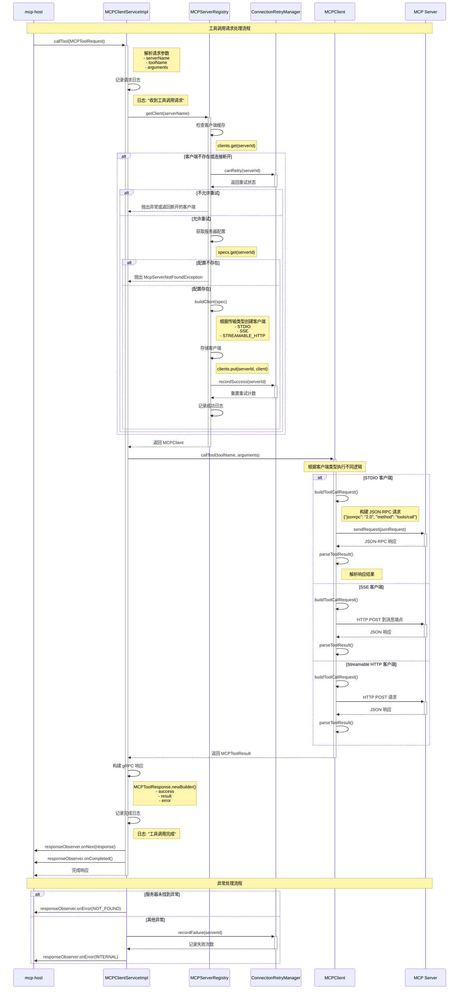

# MCP Client 工具调用处理流程

以下是 mcp-client 接收到工具调用请求时的详细处理流程图：

## 关键组件说明

### 1. MCPClientServiceImpl
- **职责**: gRPC 服务实现，处理来自 mcp-host 的工具调用请求
- **主要方法**: `callTool(MCPToolRequest, StreamObserver<MCPToolResponse>)`
- **异常处理**: 捕获并转换为适当的 gRPC 状态码

### 2. MCPServerRegistry
- **职责**: 管理 MCP 服务器配置和客户端连接
- **连接管理**: 使用 `ConcurrentHashMap` 缓存客户端连接
- **重连机制**: 检测断开连接并自动重建客户端

### 3. ConnectionRetryManager
- **职责**: 管理连接重试逻辑
- **策略**: 指数退避算法 (1s → 2s → 4s → ... → 60s)
- **阈值**: 连续失败 10 次后停止重试

### 4. MCPClient 实现类
- **MCPStdioClient**: 通过标准输入输出与子进程通信
- **MCPSseClient**: 通过 Server-Sent Events 与 HTTP 服务器通信
- **MCPStreamableHttpClient**: 通过 HTTP 流式请求与服务器通信

### 5. 工具调用协议
- **格式**: JSON-RPC 2.0
- **方法**: `tools/call`
- **参数**: 工具名称和参数映射
- **响应**: 包含成功状态、结果或错误信息

## 错误处理机制

1. **服务器未找到**: 返回 `NOT_FOUND` 状态
2. **连接失败**: 记录失败次数，触发重试机制
3. **工具调用失败**: 返回 `INTERNAL` 状态，包含详细错误信息
4. **超时处理**: gRPC 客户端设置超时时间，防止长时间阻塞

## 性能优化

1. **连接复用**: 缓存客户端连接，避免重复创建
2. **异步处理**: 使用 gRPC 的 StreamObserver 进行异步响应
3. **并发安全**: 使用 `ConcurrentHashMap` 保证线程安全
4. **智能重试**: 基于指数退避的重试策略，避免频繁重连